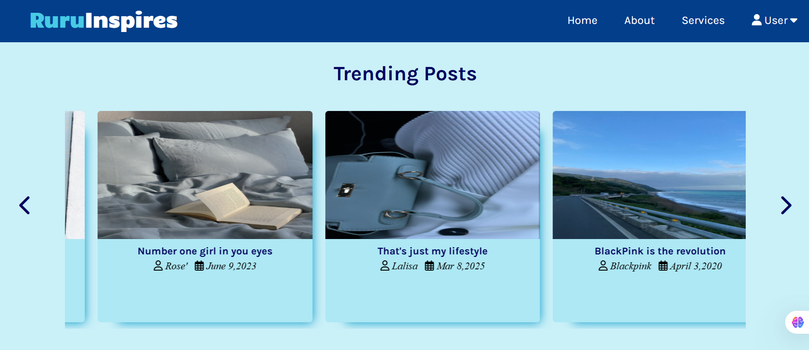
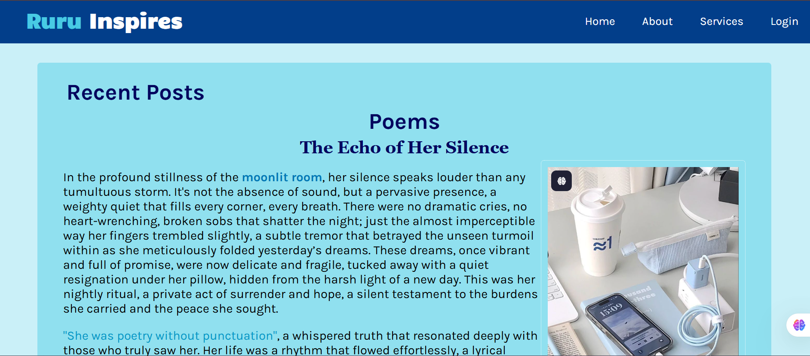
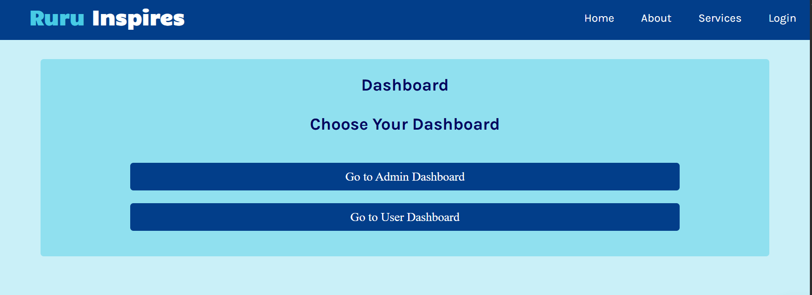

# 🌟 Ruru Inspires – A Personal Blog Platform

**Ruru Inspires** is a passion-driven, static blog website designed to express ideas, creativity, and life experiences. It is a beautifully styled platform showcasing hand-crafted content across multiple categories like **Poems**, **Quotes**, **Fiction**, **Biography**, **Motivation**, **Inspiration**, and **Life Lessons**.

This project is fully built using **HTML, CSS, JavaScript**, and follows a clean, responsive layout that reflects a **classic blue aesthetic** to engage readers and offer a serene browsing experience.

---

## 🚀 Live Preview

🌐 [Visit Ruru Inspires](https://sayeeg-11.github.io/ruru-inspires/)

---

## 📁 Project Structure
ruru-inspires/
- ├── index.html               # Homepage with category highlights
- ├── about.html               # About the creator and blog vision
 - ├── service.html             # Blog submission and community offerings
- ├── admin.html               # Admin dashboard (create, manage posts)
- ├── dashboard.html           # User dashboard (personal posts view)
- ├── logout.html              # Simple logout landing page
- │
- ├── styles/                  # Folder for all CSS files
- │   └── style.css            # Global styling
- │
- ├── blogs/                   # All blog pages categorized here
- │   ├── poems.html
- │   ├── quotes.html
- │   ├── fiction.html
- │   ├── biography.html
- │   ├── motivation.html
- │   ├── inspiration.html
- │   └── life-lessons.html
- │
- ├── assets/                  # Images, icons, and brand assets
- │
- └── README.md                # This file

---

## 🖼️ Features

- 🎨 **Elegant UI** – Classic blue theme with readable typography and well-styled content.
- 📚 **Diverse Blog Categories** – Posts under Poems, Quotes, Fiction, Biography, and more.
- 📱 **Fully Responsive Design** – Optimized for mobile, tablet, and desktop.
- 👩‍💼 **Admin Panel** – Create and manage blog posts.
- 🧑‍💻 **User Dashboard** – Access your personal posts.
- 🌐 **Static Website** – Easy to deploy on GitHub Pages.
- 📝 **Rich HTML Content** – Custom-styled paragraphs, italics, bold text, and color emphasis.
- 🧩 **Modular Structure** – Pages are cleanly separated and reusable.

---

## 💡 Inspiration

Ruru Inspires is born from a deep love for **writing**, **self-expression**, and **inspiring others** through words. Whether it’s a moving poem, a quote to lift your spirits, or a fictional tale with a message—this blog is a voice and a vision.

---

## 🛠️ Technologies Used

- **Frontend:** HTML5, CSS3
- **Styling:** Custom CSS, Fonts, Color Palettes
- **Version Control:** Git & GitHub
- **Deployment:** GitHub Pages

---

## 📸 Screenshots

| Home Page | Blog Sample | Dashboard |
|-----------|-------------|-----------|
|  |  |  |


🔗 GitHub: [@sayeeg-11](https://github.com/sayeeg-11)

---

## 🛠️ How to Run Locally

1. Clone the repository:
   ```bash
   git clone https://github.com/sayeeg-11/ruru-inspires.git
Open index.html in your browser.

No backend setup required. It’s a fully static website.

🌍 Hosting on GitHub Pages
This website is deployed via GitHub Pages:

Repository: sayeeg-11.github.io/ruru-inspires/

To update: Push changes to the main branch.

🤝 Contributing
Contributions are welcome! Feel free to fork the repo, suggest improvements, or collaborate.

📜 License
This project is open-source and available under the MIT License.

📢 A Final Word
“The world needs your voice. Ruru Inspires is where words become wonders.” 🌈
Thank you for reading, writing, and believing.
